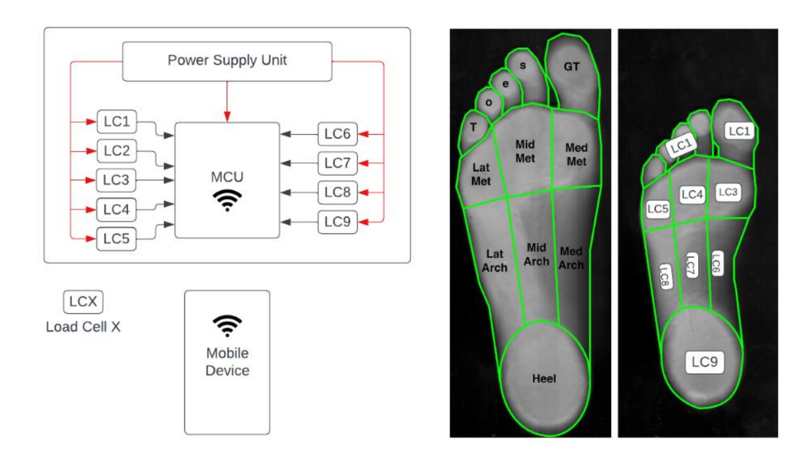
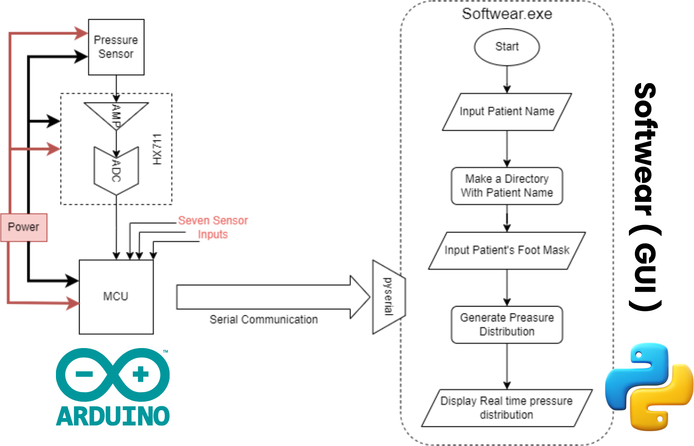

# Walking Abnormality Aetector
1. [Need Statement](#need-statement)
2. [Proposed Solution - Pressure-Measuring Footwear](#proposed-solution---a-pressure-measuring-footwear)
3. [Components](#components)
   1. [Load Cells](#load-cells)
   2. [Sensor Configuration](#sensor-configuration)
   3. [Control Unit (ESP32)](#control-unit-esp32)
4. [Predicated Device](#predicated-device)
5. [Features](#features)
6. [Functional Block Diagram](#functional-block-diagram)

## 1. Need Statement 

An imperative need exists for a method to comprehensively analyze the inability to detect gait abnormalities in children, which often result from incorrect gestures during childhood development. As many young individuals adopt improper stepping methods, gait abnormalities can manifest, potentially leading to conditions such as osteoarthritis. Traditionally, parents and elders have resorted to manual leg manipulation as a remedy, but it is increasingly evident that early intervention through precise analysis of gait patterns and bone structures during childhood is essential for effective treatment strategies.

## 2. [Proposed Solution - a Pressure-Measuring Footwear](#proposed-solution---a-pressure-measuring-footwear) 

The proposed solution is wearable footwear equipped with the capability to measure real-time pressure distribution variations. This component consists of specially designed shoes equipped with electronic load cell weighing sensors embedded in the sole. The primary purpose of this component is to conduct gait analysis for the detection of incorrect postures. Embedded within the sole of each shoe are electronic load cell weighing sensors, strategically positioned in regions deemed critical for accurate weight distribution analysis. To ensure a comprehensive and reliable dataset, a minimum of 9 load cells is employed. It's worth noting that increasing the number of sensors enhances precision. The signals generated by each load cell are subsequently routed to a Microcontroller Unit (MCU) equipped with Wi-Fi connectivity. This enables direct communication with external devices such as computers or mobile phones, facilitating real-time data transfer and analysis.

## 3. Components 

### 3.1 Load Cells 

The use of 50kg load cells with a precision of 0.1% is technically sound for the intended purpose of measuring pressure distribution. These load cells offer the necessary sensitivity to capture subtle variations in pressure across different foot regions.

### 3.2 Sensor Configuration 

The requirement for nine load cells aligns with measuring pressure distribution across nine main parts of the foot. This is the minimal configuration. Increasing the number of sensors results in more precision. This configuration ensures comprehensive data collection, enhancing the accuracy and relevance of the results.

### 3.3 Control Unit (ESP32) 

The selection of the ESP32 as the control unit demonstrates technical feasibility. ESP32 is a versatile microcontroller with built-in Wi-Fi capabilities, making it suitable for data collection and communication tasks.

## 4. Predicated Device 

The predicate device was a walking pressure mat. The proposed device is a wearable insole with a pressure-sensing unit installed in the base. The data will be fed to a microcontroller. After processing, data will be transmitted to the computer through serial communication. The pressure distribution will be displayed on the computer through an application. By analyzing the pressure distribution, predictions can be made regarding the condition.

## 5. Features 

### 5.1 Wireless Connectivity

Our market-ready prototype features seamless WiFi communication, enabling real-time data transmission to a secure database for efficient and immediate storage of patient information.

### 5.2 Portability

Designed for on-the-go use, our portable device ensures flexibility in healthcare monitoring, allowing medical professionals to access critical patient data anytime, anywhere.

### 5.3 Intuitive App

The accompanying app provides a user-friendly interface, empowering healthcare providers to monitor and manage patient data with ease, fostering a more connected and responsive healthcare ecosystem.

Software (GUI)

### 5.4 Innovative Pressure Sensing Technology

Our custom pressure sensors, crafted from cutting-edge velostat material, boast unparalleled accuracy and sensitivity. These sensors respond dynamically to pressure changes, ensuring precise data collection for enhanced diagnostics. The high sensor density further optimizes the device's ability to capture and interpret subtle variations in pressure, elevating diagnostic capabilities to new heights.

## 6. Functional Block Diagram 

